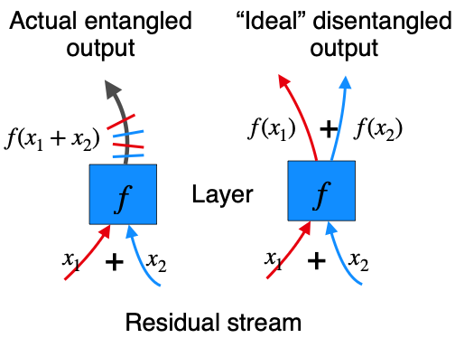
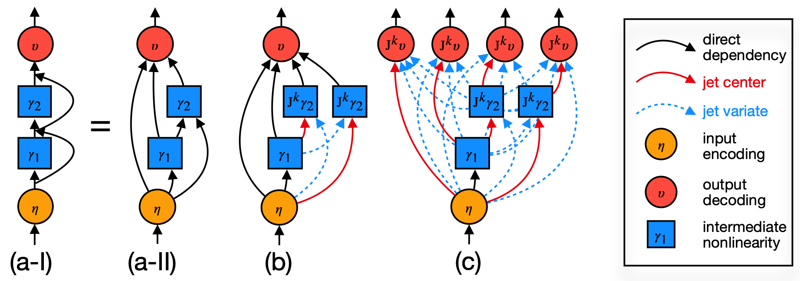

# JetExpansions

Interpretability with jet expansions of residual networks and transformers.


Code for the paper [Decomposing LLM Computation with Jets](https://openreview.net/pdf?id=u6JLh0BO5h) (ICLR 2026).

<p align="center"></p>

## Installation

```bash
# Standard install
uv sync

# Development install (includes pytest)
uv sync --group dev

# Examples install (includes jupyter, matplotlib, seaborn)
uv sync --group examples

# All groups
uv sync --all-groups

# Activate the environment, or prefix commands with `uv run` (e.g. `uv run pytest`)
source .venv/bin/activate
```

## Start

Carving a two-block residual network into four explicit input→output paths (this implements Sec 4.2 of the paper):

```python
import torch
import jex

lm = jex.toy_two_layer_rn(d=32)

x0 = lm.residual_stream(0)  # Enc(z)
x1 = lm.layer_gamma(0)      # γ₁(Enc(z))

# Step 1: expand blk2 at {x0, x1} → 4 sub-streams (γ₂ and identity terms per center)
inner = jex.expand_lm(lm, layer=2, centers=[x0, x1], order=1)

# Step 2: expand decoder at inner sub-streams → paths in logit space
outer = jex.expand_lm(lm, layer=lm.depth + 1, centers=inner.terms, order=1)

# Done: we have functionally "expanded" the model into 4 input-to-output paths
assert len(outer.terms) == 4

# Now we can compute these paths on any input
z  = torch.randint(0, lm.vocab_size, (1, 8))  # (batch, seq_len)
paths, remainder = outer.expansions_and_remainder(z, with_unembedding=True)
```

<p align="center"></p>

Beside this toy expansion, here are example notebooks of some applications:
- [Jet lenses](examples/lenses.ipynb) — iterative and joint jet lenses on GPT-2/GPT-Neo
- [Jet bigrams](examples/bigrams.ipynb) — token transition probabilities via embedding and MLP paths


## What's inside

- Pytorch implementation of jet operator via `jvp` (Jacobian vector product);
- composable `jet_expand` algorithm. This comes in two versions:
  - a generic version for any `Tensor` -> `Tensor` callable;
  - a specialised version for residual nets/transformers and expansions around block non-linearities, closely aligned to Algorithm 1 from the paper;
- loaders and abstractions for some HF models (gpt2, gpt neo, llama, ...); extensible to other models (contributions welcomed!);
- iterative and joint jet lenses;
- jet bigrams: `embedding_decoder` and `embedding_mlp_decoder` paths.
- example notebooks for jet lenses and jet bigrams.

The package aims at providing the core algorithms and applications of the paper, favouring clarity and generality over (model) specific optimization.
The package does not reproduce all experiments in the paper and nor does it include jet trigrams, since all these were based on an older version of the code that included model-specific optimizations.
If you're interested in those, please open an issue.

## Citation

```bibtex
@inproceedings{chen2026decomposing,
  title     = {Decomposing {LLM} Computation with Jets},
  author    = {Chen, Yihong and Xu, Xiangxiang and Stenetorp, Pontus and Riedel, Sebastian and Franceschi, Luca},
  booktitle = {The Fourteenth International Conference on Learning Representations},
  year      = {2026},
  url       = {https://openreview.net/pdf?id=u6JLh0BO5h}
}
```
